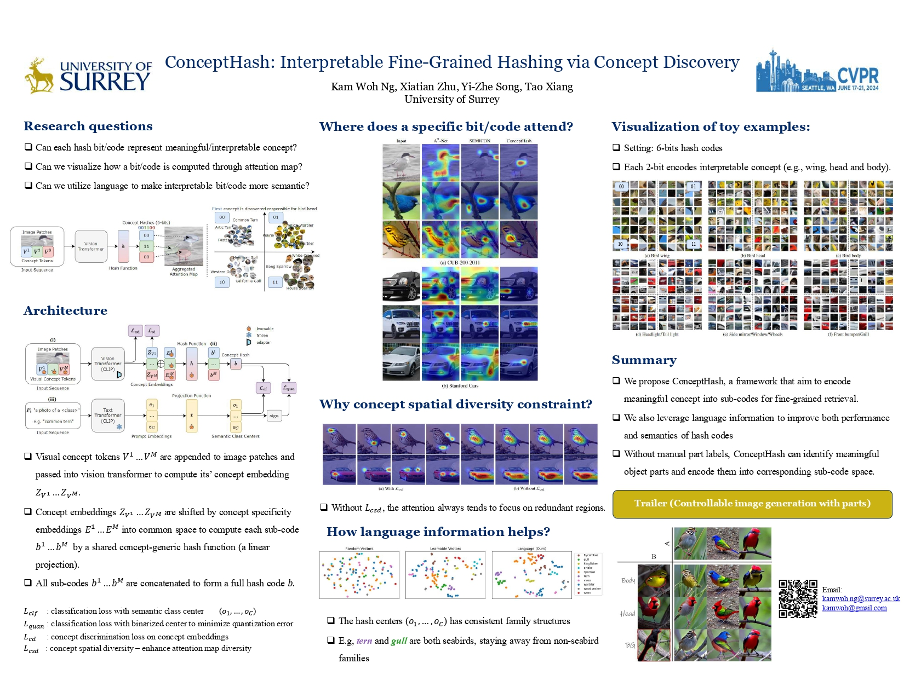

# ConceptHash: Interpretable Fine-Grained Hashing via Concept Discovery (CVPRW 2024)



Haven't clean my dirty code. For the main algorithm please run

```commandline
python main_v2.py dataset=cub200 model=concept_hash_final_v1_nosa_apt optim=sgd model.nbit=64
```

For `utils` import error, please refer to this repository `https://github.com/kamwoh/sdc/tree/master/utils`.
